# 低资源地区县域级土地利用动态监测与决策支持系统

<div align="center">

**基于Qwen2.5-VL多模态大模型的土地利用智能分析平台**

<br>

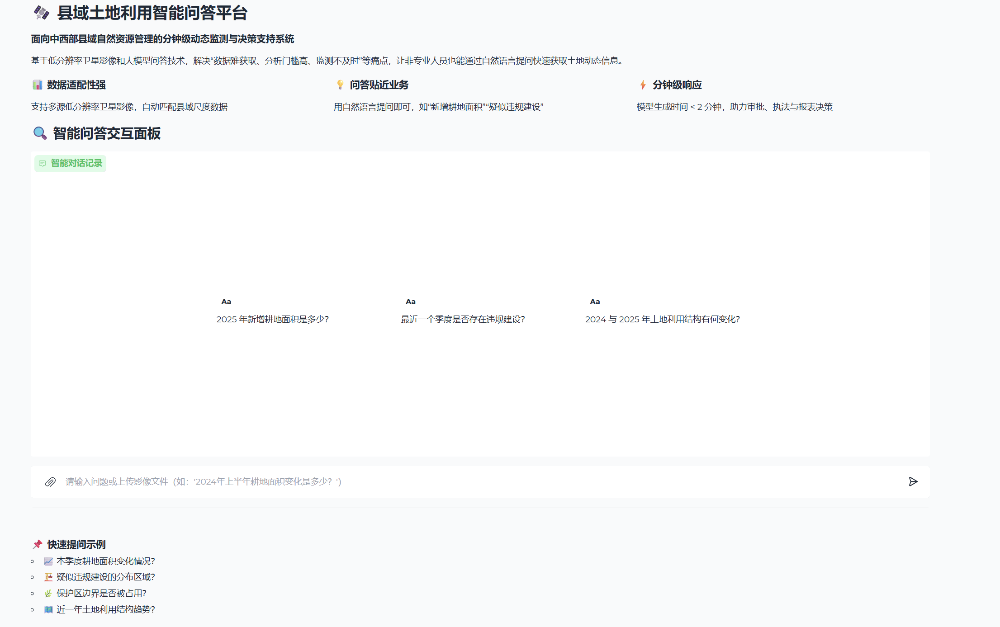

<br>


</div>

---

## 📑 目录

- [📋 项目简介](#-项目简介)
- [🏗️ 系统架构](#️-系统架构)
- [📊 数据集说明](#-数据集说明)
  - [1️⃣ 阶段一：MMDU](#1️⃣-阶段一mmdu多模态文档理解数据集)
  - [2️⃣ 阶段二：RSVQA](#2️⃣-阶段二rsvqa遥感视觉问答数据集)
- [🚀 快速开始](#-快速开始)
- [🎓 模型训练](#-模型训练)
  - [阶段一：SFT-LoRA-Vision](#阶段一sft-lora-vision视觉增强训练)
  - [阶段二：GRPO](#阶段二grpo遥感问答强化对齐)
  - [模型合并](#模型合并可选)
- [🖥️ Web界面部署](#️-web界面部署)
- [📈 训练参数说明](#-训练参数说明)
- [🎯 应用场景](#-应用场景)
- [💾 显存优化建议](#-显存优化建议)
- [🧪 技术细节](#-技术细节)
- [📁 微调部分项目结构](#-微调部分项目结构)
- [📁 评估部分项目结构](#评估部分项目结构evaluation目录下)
- [环境配置](#环境配置)
- [微调&评分模型部署](#微调评分模型部署)
- [输出目录说明](#输出目录说明)
- [评测数据集准备](#评测数据集准备)
- [💡 回答生成](#回答生成)
- [🎓 智能体评分](#智能体评分)
- [❓ 常见问题](#-常见问题)
- [📚 引用](#-引用)
- [🙏 致谢](#-致谢)
- [📄 开源协议](#-开源协议)
- [📧 联系方式](#-联系方式)

---

## 📋 项目简介

本系统针对**中西部县域自然资源管理部门**在土地动态监测中面临的"数据难获取、分析门槛高、监测不及时"等痛点，基于**Qwen2.5-VL-3B-Instruct**多模态大模型，构建了一套**分钟级响应的智能问答决策支持系统**。

### 核心特性

🛰️ **低分辨率遥感影像适配**
- 支持多源低分辨率卫星影像数据（Landsat、Sentinel等）
- 自动适配县域尺度数据，无需高精度商业影像

💡 **自然语言交互**
- 非专业人员可通过日常语言提问（如"2024年新增耕地面积是多少？"）
- 自动理解业务语义，生成精准答案

⚡ **分钟级动态监测**
- 模型推理时间 < 2分钟
- 支持耕地保护、违规建设、生态监测等多场景

🎯 **两阶段训练策略**
- **阶段一（SFT-LoRA-Vision）**: 基于MMDU数据集的视觉-语言理解增强
- **阶段二（GRPO）**: 基于RSVQA数据集的遥感专业问答对齐

---

## 🏗️ 系统架构

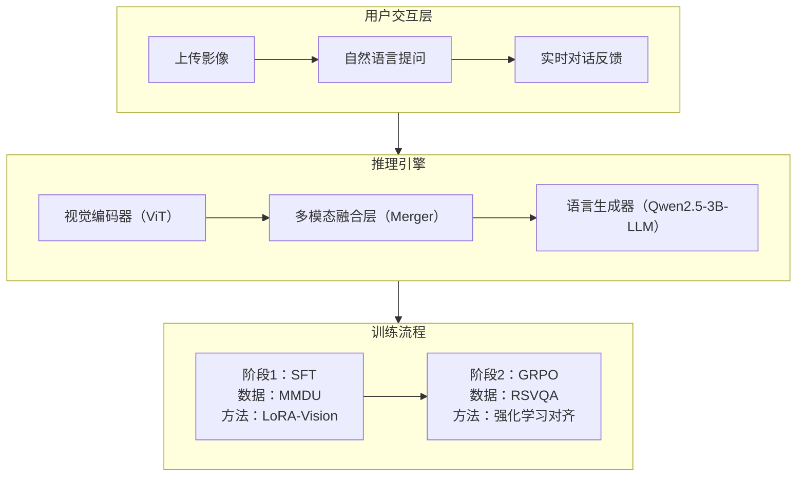

---

## 📊 数据集说明

### 1️⃣ 阶段一：MMDU（多模态文档理解数据集）

**数据位置**: `/root/autodl-tmp/qwen/MMDU/mmdu-45k.json`

**训练目标**: 增强模型对复杂视觉内容的理解能力，包括图像中的文字、结构、空间关系等

**数据格式**:
```json
[
  {
    "id": "sample_001",
    "image": "images/sample_001.jpg",
    "conversations": [
      {
        "from": "human",
        "value": "<image>\n图像中显示的主要土地类型是什么?"
      },
      {
        "from": "gpt",
        "value": "图像中显示的主要土地类型包括耕地（占比约65%）、建设用地（占比约20%）和林地（占比约15%）。"
      }
    ]
  }
]
```

### 2️⃣ 阶段二：RSVQA（遥感视觉问答数据集）

**数据位置**: `/root/autodl-tmp/data/rsvqa/rsvqa.json`

**训练目标**: 通过群体相对策略优化（GRPO）对齐遥感专业领域知识

**数据格式**:
```json
[
  {
    "id": "rsvqa_001",
    "image": "RSVQA_001.tif",
    "conversations": [
      {
        "from": "human",
        "value": "2024年与2023年相比，该区域耕地面积变化了多少平方公里？"
      },
      {
        "from": "gpt",
        "value": "根据影像分析，2024年该区域耕地面积为125.3平方公里，相比2023年的120.8平方公里，增加了4.5平方公里，增长率约为3.7%。"
      }
    ]
  }
]
```

---

## 🚀 快速开始

### 环境配置

#### 方式一：使用 Conda（推荐）

```bash
# 创建环境
conda env create -f environment.yaml
conda activate train

# 安装额外依赖
pip install qwen-vl-utils
pip install flash-attn --no-build-isolation
```

#### 方式二：使用 pip

```bash
pip install -r requirements.txt
pip install qwen-vl-utils
pip install flash-attn --no-build-isolation
```

**系统要求**:
- Ubuntu 22.04 / CentOS 7+
- CUDA 12.8+
- NVIDIA Driver 550+
- GPU显存 ≥ 24GB（推荐 A100/V100/RTX 4090）

---

## 🎓 模型训练

### 阶段一：SFT-LoRA-Vision（视觉增强训练）

**训练脚本**: [scripts/finetune_lora_vision.sh](scripts/finetune_lora_vision.sh)

**训练配置**:
```bash
#!/bin/bash

MODEL_NAME="/root/autodl-tmp/qwen/Qwen2.5-VL-3B-Instruct"
export PYTHONPATH=src:$PYTHONPATH

GLOBAL_BATCH_SIZE=8
BATCH_PER_DEVICE=1
NUM_DEVICES=1
GRAD_ACCUM_STEPS=$((GLOBAL_BATCH_SIZE / (BATCH_PER_DEVICE * NUM_DEVICES)))

deepspeed src/train/train_sft.py \
    --use_liger True \
    --lora_enable True \
    --vision_lora True \              # 关键：启用视觉塔LoRA训练
    --lora_rank 32 \
    --lora_alpha 16 \
    --lora_dropout 0.05 \
    --deepspeed scripts/zero2.json \
    --model_id $MODEL_NAME \
    --data_path /root/autodl-tmp/qwen/MMDU/mmdu-45k.json \
    --image_folder /root/autodl-tmp/qwen/MMDU/ \
    --freeze_vision_tower True \      # 冻结视觉主干，仅训练LoRA
    --freeze_llm True \               # 冻结LLM主干，仅训练LoRA
    --freeze_merger True \            # 冻结融合层
    --bf16 True \
    --output_dir /root/autodl-tmp/qwen/Qwen2-VL-Finetune/output/lora_vision_test \
    --num_train_epochs 1 \
    --per_device_train_batch_size $BATCH_PER_DEVICE \
    --gradient_accumulation_steps $GRAD_ACCUM_STEPS \
    --image_min_pixels $((256 * 28 * 28)) \
    --image_max_pixels $((1280 * 28 * 28)) \
    --learning_rate 2e-4 \
    --gradient_checkpointing True \
    --save_steps 20
```

**执行训练**:
```bash
bash scripts/finetune_lora_vision.sh
```

**预期输出**:
```
[INFO] Loading model from /root/autodl-tmp/qwen/Qwen2.5-VL-3B-Instruct...
[INFO] Found 128 lora modules for vision tower
[INFO] Training started with 45000 samples
[Step 100] loss=0.823, lr=1.95e-4
[Step 200] loss=0.654, lr=1.89e-4
...
[INFO] Training completed. Checkpoint saved to output/lora_vision_test/
```

---

### 阶段二：GRPO（遥感问答强化对齐）

**训练脚本**: [scripts/finetune_grpo.sh](scripts/finetune_grpo.sh)

**训练配置**:
```bash
#!/bin/bash

MODEL_NAME="/root/autodl-tmp/qwen/Qwen2.5-VL-3B-Instruct"
export PYTHONPATH=src:$PYTHONPATH
export PYTORCH_CUDA_ALLOC_CONF=expandable_segments:True

deepspeed --master_port=${MASTER_PORT:-29507} src/train/train_grpo.py \
    --deepspeed scripts/zero3_offload.json \
    --model_id $MODEL_NAME \
    --data_path /root/autodl-tmp/data/rsvqa/rsvqa.json \
    --image_folder /root/autodl-tmp/data/rsvqa \
    --freeze_vision_tower True \
    --freeze_llm True \
    --freeze_merger False \           # 解冻融合层以适应遥感任务
    --lora_enable True \
    --lora_rank 8 \
    --lora_alpha 16 \
    --num_train_epochs 1 \
    --num_generations 2 \             # GRPO采样生成数
    --per_device_train_batch_size 1 \
    --gradient_accumulation_steps 16 \
    --max_completion_length 32 \
    --max_prompt_length 192 \
    --learning_rate 5e-6 \
    --beta 0.04 \                     # KL散度系数
    --save_steps 100
```

**自定义奖励函数**:

系统使用多粒度奖励机制（见 [src/train/reward_funcs.py](src/train/reward_funcs.py:93)）：

```python
def route_reward(pred, ref, question, **kwargs):
    """按题型路由评分"""
    qtype = detect_question_type(question)

    if qtype == "yn":               # 是非题（精确匹配）
        return 1.0 if pred == ref else 0.0
    elif qtype == "count":          # 计数题（数值容差）
        return count_accuracy(pred, ref)
    elif qtype == "num":            # 数值题（单位归一化 + 相对误差）
        return numerical_reward(pred, ref)
    else:                           # 开放题（模糊匹配 + BLEU）
        return fuzzy_match(pred, ref) * 0.6 + bleu_score(pred, ref) * 0.4
```

**执行训练**:
```bash
bash scripts/finetune_grpo.sh
```

---

### 模型合并（可选）

如需将LoRA权重合并到基座模型：

```bash
# 修改 scripts/merge_lora.sh 中的路径
bash scripts/merge_lora.sh
```

---

## 🖥️ Web界面部署

### 启动Gradio服务

```bash
python -m src.serve.app \
    --model-path /path/to/merged/model \
    --model-base Qwen/Qwen2.5-VL-3B-Instruct \
    --device cuda \
    --temperature 0.7 \
    --max-new-tokens 1024
```

**可选参数**:
- `--load-4bit`: 启用4-bit量化推理（降低显存占用）
- `--load-8bit`: 启用8-bit量化推理
- `--disable_flash_attention`: 禁用Flash Attention 2

### 界面预览

系统提供专业的县域土地利用问答界面，包含：

✅ **功能卡片展示**
- 📊 数据适配性强（支持多源低分辨率卫星影像）
- 💡 问答贴近业务（自然语言交互）
- ⚡ 分钟级响应（快速决策支持）

✅ **智能对话面板**
- 支持上传影像文件（图片/视频）
- 多轮对话记忆功能
- 流式输出（实时查看生成过程）

✅ **快速提问示例**
```
📈 本季度耕地面积变化情况？
🏗️ 疑似违规建设的分布区域？
🌿 保护区边界是否被占用？
🗺️ 近一年土地利用结构趋势？
```

**界面访问**: 服务启动后访问 `http://服务器IP:7860`

---

## 📈 训练参数说明

### SFT训练关键参数

| 参数 | 说明 | 推荐值 |
|------|------|--------|
| `--lora_rank` | LoRA秩（越大参数越多） | 32 |
| `--lora_alpha` | LoRA缩放因子 | 16 |
| `--vision_lora` | 启用视觉塔LoRA | True |
| `--freeze_vision_tower` | 冻结视觉编码器主干 | True |
| `--freeze_llm` | 冻结语言模型主干 | True |
| `--freeze_merger` | 冻结多模态融合层 | True |
| `--image_min_pixels` | 最小图像像素（影响显存） | 200704 (256×28²) |
| `--image_max_pixels` | 最大图像像素 | 1003520 (1280×28²) |
| `--learning_rate` | 学习率 | 2e-4 |
| `--use_liger` | 启用Liger-Kernel优化 | True |
| `--deepspeed` | DeepSpeed配置文件 | scripts/zero2.json |

### GRPO训练关键参数

| 参数 | 说明 | 推荐值 |
|------|------|--------|
| `--num_generations` | 每个prompt采样生成数 | 2-4 |
| `--max_completion_length` | 最大生成长度 | 32-128 |
| `--beta` | KL散度惩罚系数 | 0.04 |
| `--temperature` | 采样温度 | 0.9 |
| `--freeze_merger` | 是否冻结融合层 | False（遥感任务需微调） |
| `--deepspeed` | DeepSpeed配置 | scripts/zero3_offload.json |

---

## 🎯 应用场景

### 1. 耕地保护监测
```
用户: "2024年第二季度新增耕地面积是多少？"
系统: "根据影像分析，2024年Q2相比Q1新增耕地约3.2平方公里，
      主要分布在县城东北部灌溉区域，符合春耕扩种规律。"
```

### 2. 违规建设排查
```
用户: "最近一个月是否存在疑似违规建设？"
系统: "检测到2处疑似违规建筑：
      ① 县城南部基本农田保护区内新增建筑面积约800㎡
      ② 河道管理范围内新增硬化地面约1200㎡
      建议现场核查。"
```

### 3. 生态保护监测
```
用户: "自然保护区边界是否被侵占？"
系统: "保护区核心区边界完整，但缓冲区东侧发现约0.5公顷
      林地转为园地，建议进一步调查用途合规性。"
```

### 4. 决策辅助分析
```
用户: "2023-2024年土地利用结构变化趋势？"
系统: "主要趋势如下：
      • 耕地面积: 120.8→125.3 km² (+3.7%)
      • 建设用地: 15.2→16.8 km² (+10.5%)
      • 林地面积: 45.3→44.1 km² (-2.6%)
      城镇化进程加快，需加强耕地占补平衡监管。"
```

---

## 💾 显存优化建议

### 不同显卡配置策略

| GPU型号 | 显存 | 训练策略 | DeepSpeed配置 |
|---------|------|----------|---------------|
| RTX 4090 | 24GB | LoRA + BF16 + Zero2 | zero2.json |
| A100 | 40GB | LoRA + BF16 + Zero2 | zero2.json |
| A100 | 80GB | LoRA + BF16 + Zero3 | zero3.json |
| V100 (16GB) | 16GB | LoRA + FP16 + Zero3 Offload + 量化 | zero3_offload.json + `--bits 8` |

### 降低显存技巧

1️⃣ **调整图像分辨率**
```bash
--image_min_pixels $((128 * 28 * 28))   # 从256降到128
--image_max_pixels $((512 * 28 * 28))   # 从1280降到512
```

2️⃣ **启用梯度检查点**
```bash
--gradient_checkpointing True
```

3️⃣ **使用Zero3 Offload**
```bash
--deepspeed scripts/zero3_offload.json
```

4️⃣ **8-bit量化训练**
```bash
--bits 8 --use_liger True
```

---

## 🧪 技术细节

### LoRA训练策略

本系统采用**分层冻结+LoRA微调**策略：

```
视觉塔（Visual Tower）  →  仅LoRA适配层可训练
融合层（Merger）        →  阶段一冻结，阶段二解冻
语言模型（LLM）         →  仅LoRA适配层可训练
```

**优势**:
- 参数高效：仅训练 < 5% 参数
- 稳定性强：避免过拟合
- 可组合性：支持多任务LoRA合并

### GRPO奖励设计

遥感问答任务的奖励函数需考虑：

1. **数值题容差机制**（如面积、距离）
```python
rel_err = abs(pred - ref) / (abs(ref) + 1e-8)
reward = exp(-rel_err * 5) if rel_err > 0.02 else 1.0
```

2. **单位自动归一化**
```python
def unify_unit(val, unit):
    if unit in ["km", "kilometer"]: return val * 1000
    elif unit in ["cm"]: return val / 100
    return val
```

3. **题型自动路由**
```python
if "是否" in question: return exact_match_reward()
elif re.search(r"多少|面积|距离", question): return numerical_reward()
else: return fuzzy_match_reward()
```

---

## 📁 微调部分项目结构

```
QwenVL-Finetune/
├── src/
│   ├── train/
│   │   ├── train_sft.py          # SFT训练主程序
│   │   ├── train_grpo.py         # GRPO训练主程序
│   │   ├── reward_funcs.py       # 自定义奖励函数
│   │   └── monkey_patch_*.py     # 模型修改补丁
│   ├── dataset/
│   │   ├── sft_dataset.py        # SFT数据加载器
│   │   └── grpo_dataset.py       # GRPO数据加载器
│   ├── trainer/
│   │   ├── sft_trainer.py        # 自定义SFT Trainer
│   │   └── grpo_trainer.py       # 自定义GRPO Trainer
│   ├── serve/
│   │   └── app.py                # Gradio Web界面
│   └── constants.py              # 全局常量定义
├── scripts/
│   ├── finetune_lora_vision.sh   # 阶段一训练脚本
│   ├── finetune_grpo.sh          # 阶段二训练脚本
│   ├── merge_lora.sh             # LoRA合并脚本
│   ├── zero2.json                # DeepSpeed Zero2配置
│   └── zero3_offload.json        # DeepSpeed Zero3+Offload配置
├── requirements.txt              # Python依赖列表
├── environment.yaml              # Conda环境配置
└── README_CN.md                  # 本文档
```


-----


## 📁评估部分项目结构（evaluation目录下）

> 评估模块负责多图多轮语境下Qwen-VL系列（不包括最新开源的Qwen3-VL-235B）微调前后模型的评估，主要代码包括回答模型生成、打分模型评估两部分。

```bash
tree /F

│  README.md
│
├─model_generation
│      QLoRA-Qwen-2.5-VL-3B_gen_ans.py
│
└─scores
        qwen2.5_vl_3b_prompt.py
        README.md
        statistic.py
```


## 环境配置

```bash
# 创建虚拟环境并激活
conda create -n myenv python=3.10 -y
conda activate myenv

# 永久配置清华镜像源
pip config set global.index-url https://pypi.tuna.tsinghua.edu.cn/simple

# 安装N卡CUDA版本的PyTorch库,128适配CUDA12.8，可结合实际情况调整
pip install torch  --index-url https://download.pytorch.org/whl/cu128

pip install transformers qwen_vl_utils
pip install peft
pip install huggingface-hub modelscope
pip install tqdm matplotlib
```


## 微调&评分模型部署

```bash
huggingface-cli download Qwen/Qwen2.5-VL-3B-INstruct \
--local-dir=Qwen2.5-VL-Base-Answer \
--local-dir-use-symlinks False \
--resume-download
```

```bash
huggingface-cli download Qwen/Qwen2.5-VL-3B-INstruct \
--local-dir=Qwen2.5-VL-Judge \
--local-dir-use-symlinks False \
--resume-download
```

*QLoRA微调权重在`QLoRA-Qwen-2.5-VL-3B_gen_ans.py`代码中自动从ModelScope网站拉取，并将Adapter参数存储到`Qwen2.5-VL-Answer`目录下*


## 输出目录说明

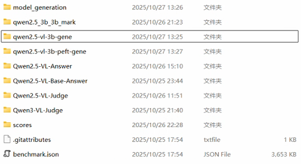

如图所示，3b-gene对应原始模型的对话输出，3b-peft-gene对应在MMDU-45k上QLoRA微调之后的对话输出，mark目录存储评分文件。


## 评测数据集准备

1. huggingface MMDU组合（微调+评测）数据集链接：

   ### 评测数据集特性

   - 110轮对话

   - 1600个问答对

   - 422张图片

   - 平均每个对话场景15个问题，3.8张图片，6400个词汇的Ground Truth参考答案

   - 覆盖地理、艺术、电影、交通、医药、动物、社会、建筑、城市、化学等多个方面

     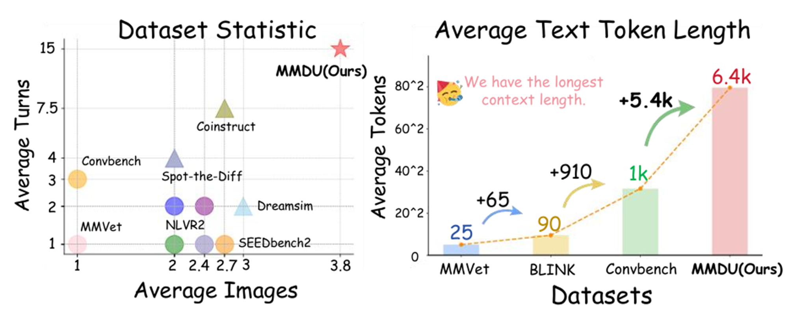

   >[laolao77/MMDU at main](https://huggingface.co/datasets/laolao77/MMDU/tree/main)

2. 使用命令行拉取评测数据集文件

   ```bash
   huggingface-cli download laolao77/MMDU benchmark.json mmdu_pics.zip \
   --local-dir . \
   --local-dir-use-symlinks False \
   --repo-type dataset\
   --resume-download
   ```

   

3. 本地解压缩mmdu_pics.zip之后，在model_generation目录和scores目录分别粘贴一份mmdu_pics，根目录下可删除; benchmark.json文件保持在根目录位置。

   

## 💡回答生成

调用model_generation目录下的`QLoRA-Qwen-2.5-VL-3B_gen_ans.py`文件，生成的每个json文件对应Benchmark的每个对话场景的问题和模型回复，图片以本地存储路径的文本方式嵌入对话。

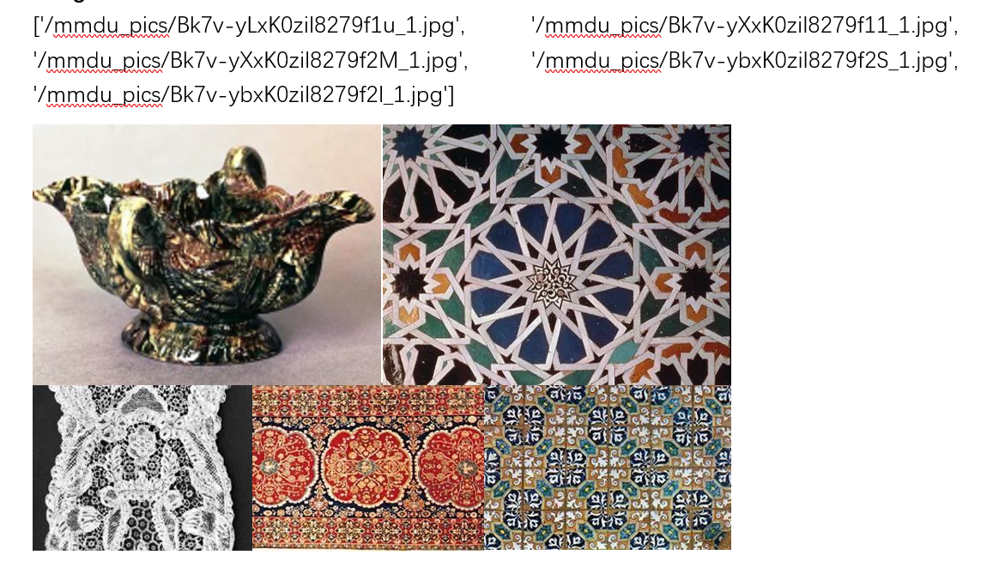

在代码执行的generate方法中根据硬件设备情况调整`max_new_tokens`参数，由于对话轮数平均15轮左右，不同显卡配置应根据情况灵活调整，例如：

> 对于12GB+16GB（共享）显存的GeForce RTX 5070建议设置为128或者更低。
>
> 对于32GB+24GB（共享）显存的GeForce RTX 5090建议设置为256或者更低。


#### 回答生成参考示例

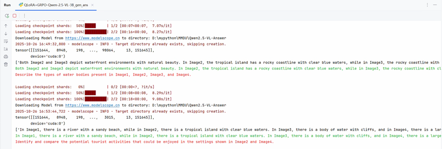

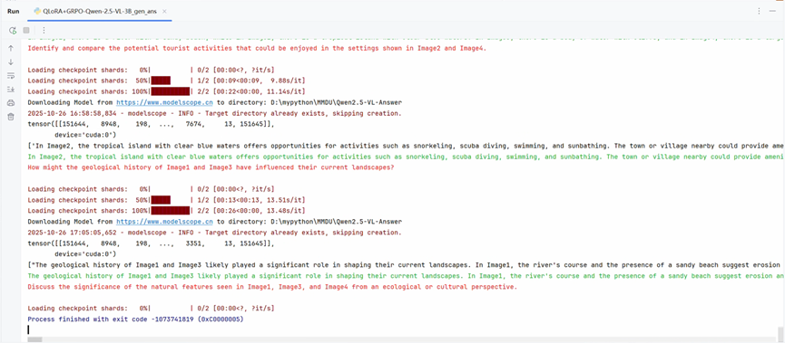


## 🎓智能体评分 

本评估模块的智能体评分采用本地部署本地推理的方式，完全免费但是模型参数量、推理表现和推理速度一定程度上受限。**对于前一部分每个对话场景生成的json问答文件，结合对话中生成的Reference Answer和Benchmark的Ground Truth，在Scoring rules的原则指导下，对每轮问答进行打分。**

选用Qwen2.5-VL-3B-Instruct模型进行评分，调用scores目录下的`qwen2.5_vl_3b_prompt.py`文件运行，理论上生成的每个json文件对应每个对话场景，包括每轮问答的六维评分和综合得分，下面是具体的六维评分细则。


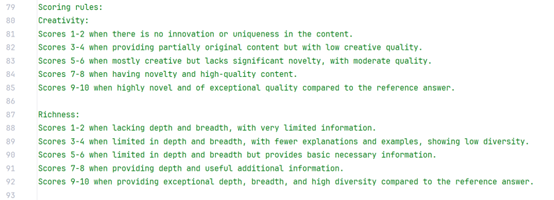

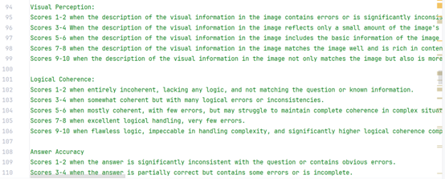

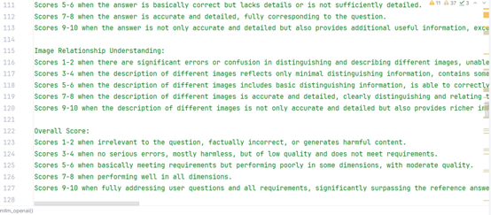

*注意受到硬件因素的影响，实际评分计算方式作出了调整，通过等权重计算每轮问答-有效评分的平均分的方式，给出综合得分，如果一轮对话内评分模型给出了最终综合得分，按照6倍权重进行计算，但需要注意的是，实际测评中即使上下文长度不做约束也往往不能给出。*

#### 评分生成参考示例

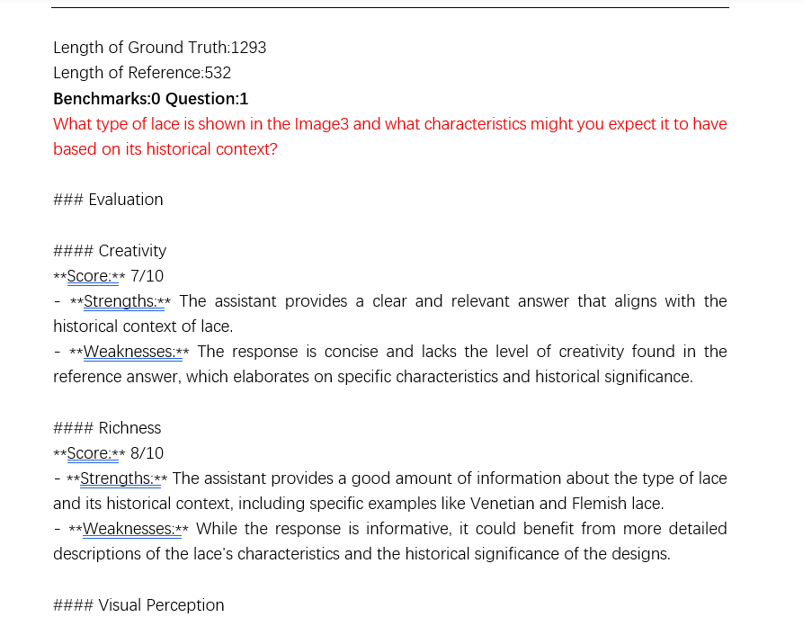

#### 🎯高级功能

> `statistics.py`针对多个对话场景进行综合得分汇总的计算，可以给出更权威更可靠的评分判断。


## ❓ 常见问题

### Q1: 训练时显存不足怎么办？

**A**: 尝试以下方案（按优先级排序）：
```bash
# 方案1：降低图像分辨率
--image_max_pixels $((512 * 28 * 28))

# 方案2：减小batch size并增加梯度累积
--per_device_train_batch_size 1 --gradient_accumulation_steps 32

# 方案3：使用Zero3 Offload
--deepspeed scripts/zero3_offload.json

# 方案4：启用8-bit训练
--bits 8
```

### Q2: libcudnn相关错误如何解决？

**A**: 运行以下命令清除环境变量：
```bash
unset LD_LIBRARY_PATH
```
参考：[相关issue](https://github.com/andimarafioti/florence2-finetuning/issues/2)

### Q3: 如何调整GRPO的奖励函数？

**A**: 修改 [src/train/reward_funcs.py](src/train/reward_funcs.py)，所有以 `_reward` 结尾的函数会自动被加载：
```python
def custom_land_use_reward(pred, ref, question, **kwargs):
    """自定义土地利用奖励"""
    # 您的逻辑
    return reward_score
```

### Q4: 训练后如何评估模型性能？

**A**: 系统在训练过程中会自动记录TensorBoard日志：
```bash
tensorboard --logdir ./output/lora_vision_test/runs
```

### Q5: 支持多GPU训练吗？

**A**: 支持，修改训练脚本：
```bash
# 使用4张GPU
deepspeed --num_gpus=4 src/train/train_sft.py ...
```

---

## 📚 引用

如果本项目对您的研究有帮助，请引用：

```bibtex
@software{LandUseMonitoringSystem2025,
  title = {Low-Resource County-Level Land Use Dynamic Monitoring and Decision Support System},
  author = {Jiongning Zhao},
  year = {2025},
  note = {Based on Qwen2.5-VL-3B-Instruct},
  url = {https://github.com/Johnny-creation/QwenVL-Finetune}
}
```

**基础模型引用**:
```bibtex
@article{Qwen2VL,
  title={Qwen2-VL: Enhancing Vision-Language Model's Perception of the World at Any Resolution},
  author={Wang, Peng and Bai, Shuai and Tan, Sinan and Wang, Shijie and Fan, Zhihao and Bai, Jinze and Chen, Keqin and Liu, Xuejing and Wang, Jialin and Ge, Wenbin and Fan, Yang and Dang, Kai and Du, Mengfei and Ren, Xuancheng and Men, Rui and Liu, Dayiheng and Zhou, Chang and Zhou, Jingren and Lin, Junyang},
  journal={arXiv preprint arXiv:2409.12191},
  year={2024}
}
```

---

## 🙏 致谢

本项目基于以下开源项目构建：

- [Qwen2-VL-Finetune](https://github.com/2U1/Qwen2-VL-Finetune) - 原始微调框架
- [Qwen2.5-VL](https://huggingface.co/Qwen/Qwen2.5-VL-3B-Instruct) - 基座模型
- [Liger-Kernel](https://github.com/linkedin/Liger-Kernel) - 高效训练优化
- [TRL](https://github.com/huggingface/trl) - GRPO训练框架

**数据集来源**:
- MMDU: 多模态文档理解数据集
- RSVQA: 遥感视觉问答数据集

---

## 📄 开源协议

本项目采用 [Apache-2.0 License](LICENSE) 开源协议。

---

## 📧 联系方式

如有问题或合作意向，欢迎联系：

- **Email**: 3150909949@qq.com
- **项目地址**: https://github.com/Johnny-creation/QwenVL-Finetune
- **问题反馈**: [GitHub Issues](https://github.com/Johnny-creation/QwenVL-Finetune/issues)

---

<div align="center">

**⭐ 如果这个项目对您有帮助，请给个Star支持一下！⭐**

Made with ❤️ for County-Level Natural Resource Management

</div>
